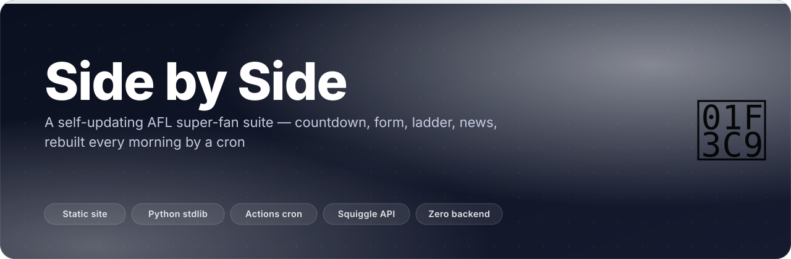
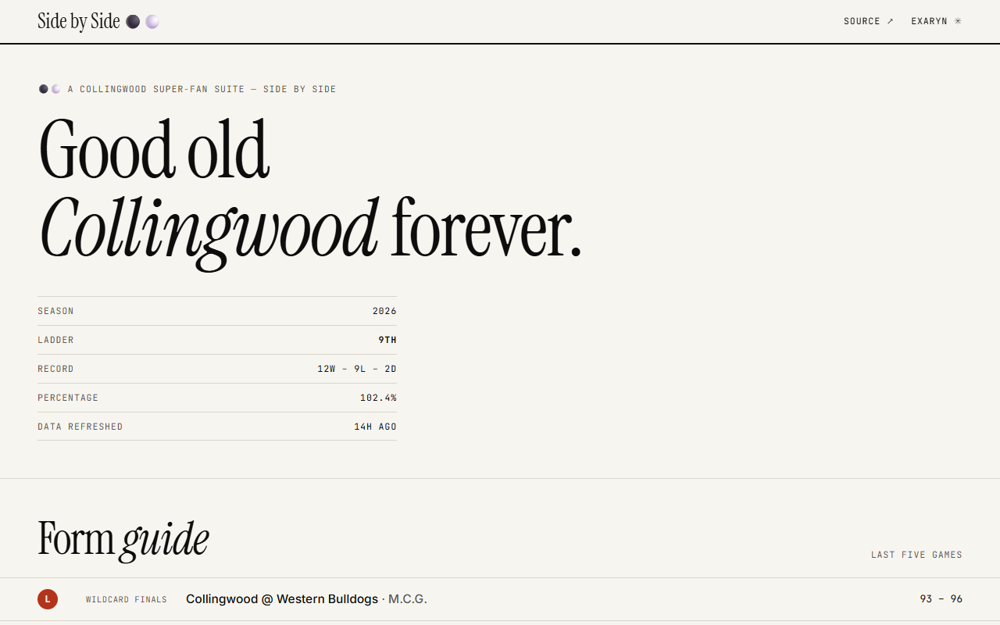
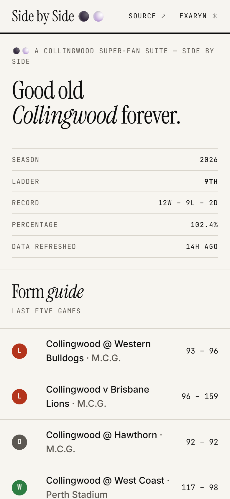
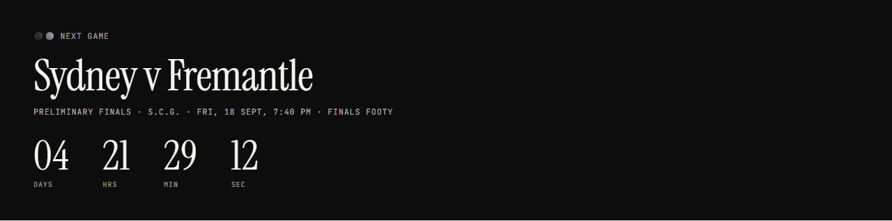
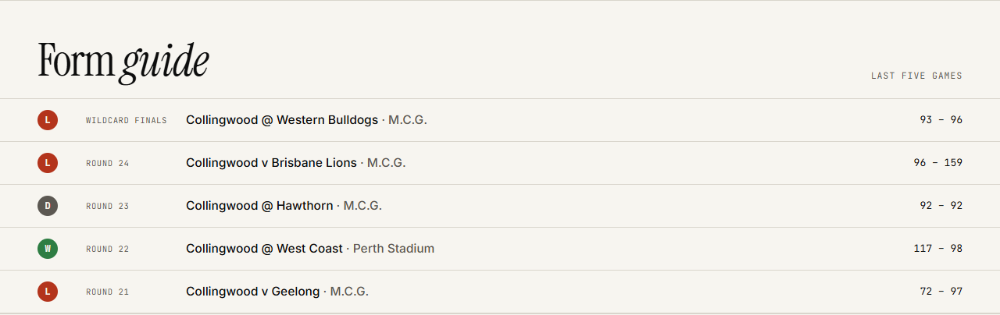
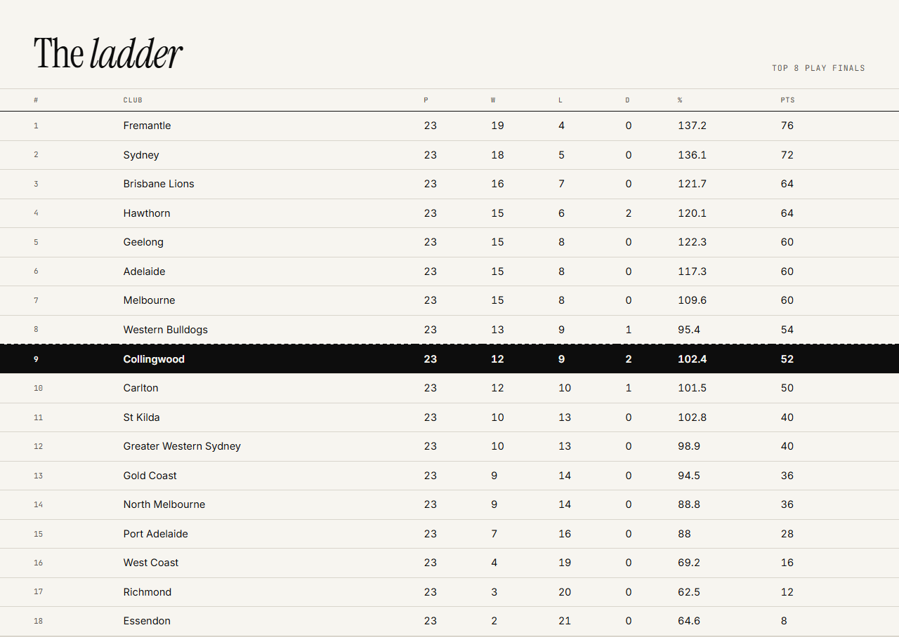
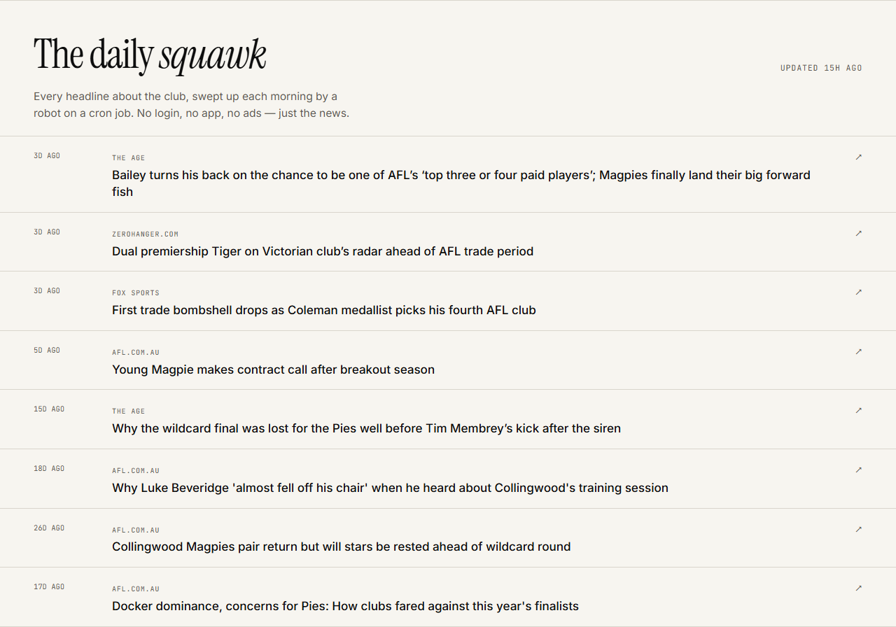
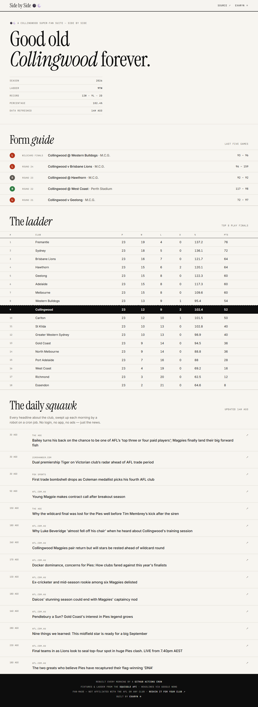
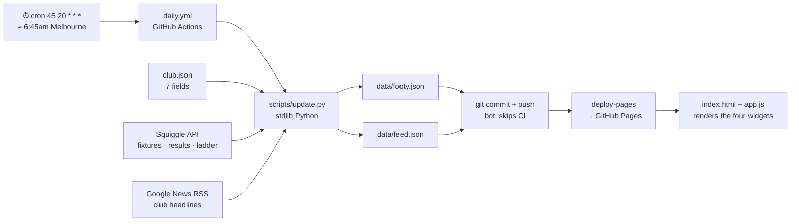
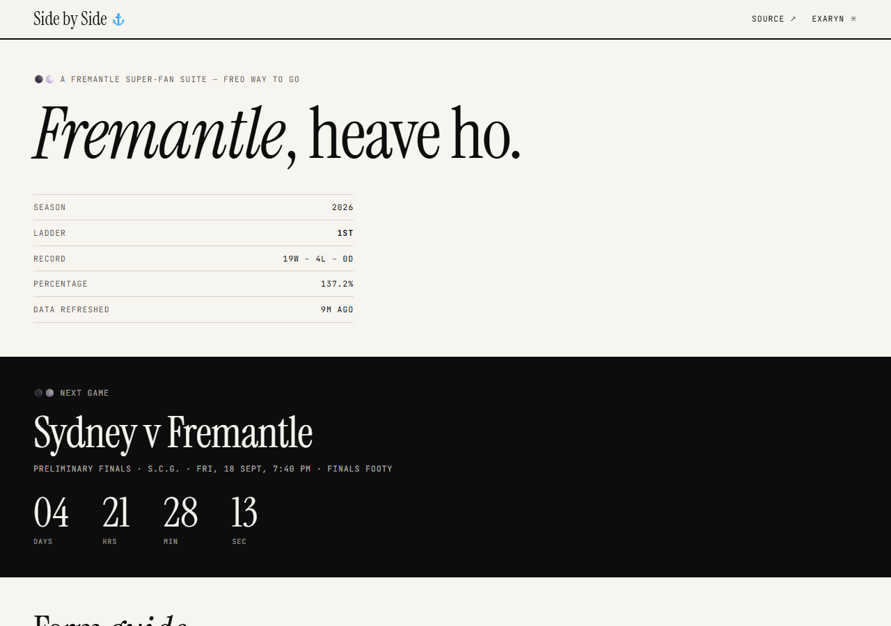

<p align="center"></p>

<p align="center">
  <b>A footy home page that updates itself. No backend, no build step, no API keys —<br>
  just a cron job, two JSON files and one club you care about.</b>
</p>

<p align="center">
  <a href="https://chinmaygit8765.github.io/collingwood-fan-suite/"></a>
  <a href="https://github.com/ChinmayGit8765/collingwood-fan-suite/actions/workflows/daily.yml"></a>
  
  
  
</p>

## ✨ What it does

- **Next-game countdown** — opponent, round, venue, kick-off in your own timezone, and a clock that ticks down to the second. At `00:00` it flips to *GAME ON — UP THE MAGPIES!*
- **Form guide** — the last five results with W/L/D, scores and venue, newest first.
- **Live ladder** — all 18 clubs, percentage and points, the top-8 finals cut drawn as a dashed line, your club's row inverted in black.
- **The Daily Squawk** — up to 14 fresh headlines about the club, source-tagged, deduplicated, "3d ago"-stamped, straight out to the article.
- **Rebuilt every morning at 20:45 UTC** by a GitHub Actions cron that refreshes the data, commits it, and redeploys Pages in the same job — so the page and its data can never drift apart.
- **Any club, one file.** `club.json` is the whole config: 7 fields, no code change. [Proof below.](#-make-it-your-club)

## 🎬 See it

<p align="center"></p>

<table><tr>
<td width="63%"><br><sub><b>Desktop, 1280px.</b> Ladder position, W–L–D, percentage and how long ago the robot last ran.</sub></td>
<td width="37%"><br><sub><b>Mobile, 390px.</b> Same page, one column — it is a phone-first suite.</sub></td>
</tr></table>

<table><tr>
<td width="50%"><br><sub><b>The countdown.</b> Round, venue, local kick-off time, ticking clock. Hides itself when there is no fixture left.</sub></td>
<td width="50%"><br><sub><b>Form guide.</b> Last five games, colour-coded W/L/D, home <code>v</code> away <code>@</code>.</sub></td>
</tr></table>

<table><tr>
<td width="50%"><br><sub><b>The ladder.</b> All 18 clubs, dashed line under 8th, your club in black.</sub></td>
<td width="50%"><br><sub><b>The daily squawk.</b> Every headline about the club, swept up each morning.</sub></td>
</tr></table>

<details><summary><b>The whole page in one image</b></summary>

<p align="center"></p>
</details>

## 🧠 How it works



Read it left to right, once a day:

1. **The cron fires** at `45 20 * * *` (20:45 UTC — early morning in Melbourne, before anyone opens the page). `workflow_dispatch` and pushes to `main` trigger the same job; a plain push deploys as-is and skips the refresh.
2. **`scripts/update.py`** reads `club.json`, asks the [Squiggle API](https://api.squiggle.com.au) for teams, this season's games and the standings, and Google News RSS for headlines. Stdlib only — `urllib`, `xml.etree`, `email.utils` — so the runner installs nothing. If the season has no games yet it falls back to last season, so the page is never blank in the off-season.
3. **Two JSON files get written**: `data/footy.json` (next game, last five, full ladder, your club's row) and `data/feed.json` (news items). Each has its own `try/except`, so a flaky source can blank one file and not the other.
4. **The bot commits `data/`** and pushes — that daily commit doubles as repo activity, which is what stops GitHub from suspending a scheduled workflow after 60 days of quiet.
5. **Pages deploys in the same job**, so the site and the data it renders ship together.
6. **The browser does the rest**: `assets/app.js` (164 lines, no framework) fetches `club.json` and both data files, renders the widgets, and starts the countdown ticking. If a fetch fails it says so in plain language instead of showing an empty page.

The only third-party request the page itself makes is Google Fonts. No analytics, no cookies, no ads, no login, no API keys anywhere in the repo.

## 🏉 Make it your club

Everything club-specific lives in **`club.json`** — seven fields, no code change:

```json
{
  "club": "Collingwood",
  "nickname": "Magpies",
  "squiggleTeam": "Collingwood",
  "newsQuery": "\"Collingwood Magpies\" AFL",
  "tagline": "Good old Collingwood forever",
  "chant": "SIDE BY SIDE",
  "emojiBadge": "⚫⚪"
}
```

| field | what it drives |
|---|---|
| `club` | the kicker line and every "A \<CLUB\> SUPER-FAN SUITE" heading |
| `nickname` | the *UP THE \<NICKNAME\>!* line the countdown flips to at kick-off |
| `squiggleTeam` | the lookup key for fixtures, results and your ladder row — must match a name in [Squiggle's teams list](https://api.squiggle.com.au/?q=teams) |
| `newsQuery` | the Google News search string behind the Daily Squawk |
| `tagline` | the hero headline; the club's name inside it is italicised automatically |
| `chant` | printed beside the kicker above the headline |
| `emojiBadge` | the badge next to the wordmark (and the fallback if `club.json` fails to load, in which case the Collingwood defaults stand) |

**Proof it works** — swap in Fremantle, run the sweeper once, and the same code renders a Dockers suite with a live countdown to their actual preliminary final:

<p align="center"></p>

```jsonc
// club.json — the only file edited for the screenshot above
{ "club": "Fremantle", "nickname": "Dockers", "squiggleTeam": "Fremantle",
  "newsQuery": "\"Fremantle Dockers\" AFL", "tagline": "Fremantle, heave ho",
  "chant": "FREO WAY TO GO", "emojiBadge": "⚓" }
```

1. Fork the repo.
2. Edit `club.json`. `squiggleTeam` must match the club's name in the [Squiggle teams list](https://api.squiggle.com.au/?q=teams); `newsQuery` is a Google News search; the rest is flavour.
3. Optionally tweak the CSS variables at the top of `assets/style.css` if your club's colours deserve better than black and white (they don't).
4. Push to `main`, then repo **Settings → Pages → Source: GitHub Actions**.

Done — the cron does the rest, forever.

## 🚀 Quick start

```sh
npm run dev          # npx serve -l 3000 .  → http://localhost:3000
npm run refresh      # python scripts/update.py — pull fresh data right now
```

No install step: `dev` is `npx serve`, `refresh` is Python 3 with nothing but the standard library.
`fetch()` needs http, so open the page through a server rather than double-clicking `index.html`.

## 🗂️ Project layout

```
index.html                the page — 106 lines of semantic HTML, no templating
club.json                 which club this suite serves  ← the only file a fork edits
assets/style.css          black & white editorial design, CSS custom properties
assets/app.js             164 lines: fetch JSON → render widgets → tick the clock
data/footy.json           generated daily — next game, last five, ladder, club row
data/feed.json            generated daily — deduplicated news items
scripts/update.py         the sweeper: Squiggle + Google News → data/*.json
.github/workflows/daily.yml   cron, commit, Pages deploy — all one job
```

## 🧰 Stack

| layer | choice | why |
|---|---|---|
| page | hand-written HTML + one 6 KB JS file | no framework, no build step, no toolchain to rot |
| styling | plain CSS custom properties | one `:root` block to reskin; 278 lines total |
| data fetch | Python 3, standard library only | nothing to `pip install`, so the runner never breaks |
| fixtures, results, ladder | [Squiggle API](https://api.squiggle.com.au) | free, public, no key — called with a polite identifying `User-Agent` |
| headlines | Google News RSS | free per-club query; titles de-suffixed and deduplicated |
| scheduler | GitHub Actions cron | the entire backend is one cron entry |
| hosting | GitHub Pages (`deploy-pages`) | free static hosting; data and site deploy in the same job |
| storage | two JSON files committed to the repo | no database — and the git log becomes a season archive |

## 🗺️ Status

- ✅ **Live and self-refreshing** — the `data: daily refresh` commits in the log are the cron's receipts.
- ✅ **All four widgets render real data** — screenshots above are the live site, not mockups.
- ✅ **Reskinnable in one file** — verified end-to-end by running the sweeper against a Fremantle `club.json`.
- 🚧 **Off-season behaviour** — with no upcoming fixture the countdown card hides itself and the page leads with the ladder and news instead. Deliberate; the card returns the moment Squiggle lists a next game.
- 🔜 **Not built, honestly** — no tests, no player stats, no ladder predictor, and no timezone picker (the browser converts kick-off to wherever you are).

Fan-made. Not affiliated with the AFL, Collingwood, or any club — just the product of one supporter and a cron job.

<p align="center"><sub>Built by <a href="https://github.com/ChinmayGit8765">Chinmay</a> · part of the <a href="https://chinmaygit8765.github.io/exaryn-studio/">Exaryn</a> studio · Floreat Pica</sub></p>
